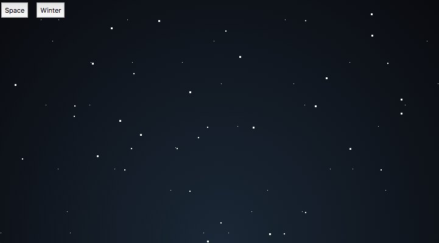
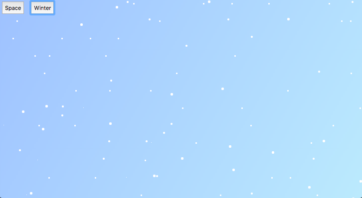

# Scrolling Stars
This is an art project that I decided to pursue in order to get a grasp of functional programming and understand jQuery better. I made it for my game Alien Cat Invasion, and I'm sure I will be able to re-use this in the future. I got the inspiration from some art done by other developers using different technology. There are currently two themes which I intend on expanding fall and summer.

# Images

